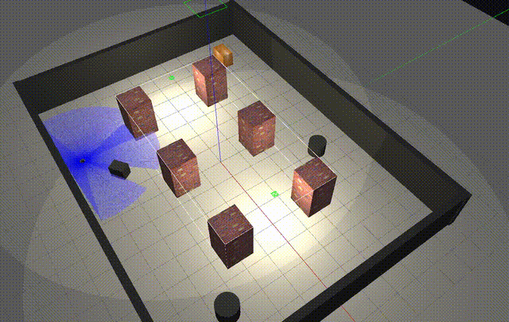
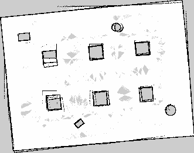

# my_bot — Autonomous Underground Mine Exploration Robot

A ROS 2 Humble project where a **TurtleBot3 Burger** explores a custom underground
**room-and-pillar mine** in Gazebo — building a map with SLAM, avoiding obstacles,
and autonomously seeking out unknown territory using frontier exploration.

The project supports three modes:
- **Manual teleop + SLAM** — drive with the arrow keys and build the map yourself.
- **Assisted obstacle avoidance** — a safety layer stops the robot driving into walls.
- **Fully autonomous frontier exploration** — the robot maps the whole mine on its own.





---

## Table of Contents
- [System Requirements](#system-requirements)
- [How It Works](#how-it-works)
- [Installation](#installation)
- [Running the Project](#running-the-project)
- [The Custom Nodes](#the-custom-nodes)
- [Project Structure](#project-structure)
- [Troubleshooting](#troubleshooting)

---

## System Requirements

- **Ubuntu 22.04** (Jammy)
- **ROS 2 Humble**
- **Gazebo Classic 11**
- **TurtleBot3** packages, **slam_toolbox**, and **Nav2**

Install the dependencies:

```bash
sudo apt install ros-humble-turtlebot3* ros-humble-slam-toolbox \
                 ros-humble-navigation2 ros-humble-nav2-bringup \
                 ros-humble-teleop-twist-keyboard ros-humble-gazebo-ros-pkgs
```

Add these to your `~/.bashrc` (the Gazebo flags are required to run inside a VM):

```bash
source /opt/ros/humble/setup.bash
source ~/ros2_ws/install/setup.bash
export TURTLEBOT3_MODEL=burger
export LIBGL_ALWAYS_SOFTWARE=1
export SVGA_VGPU10=0
export QT_QPA_PLATFORM=xcb
export GAZEBO_MODEL_DATABASE_URI=""
export GAZEBO_MODEL_PATH=$GAZEBO_MODEL_PATH:/opt/ros/humble/share/turtlebot3_gazebo/models:$HOME/.gazebo/models
```

---

## How It Works

The system is a pipeline of cooperating ROS 2 components:

| Layer | Package | Role |
|-------|---------|------|
| Simulation | Gazebo Classic | Runs the custom mine world and the TurtleBot3 with LIDAR |
| Mapping | slam_toolbox | Builds the occupancy-grid map from LIDAR scans |
| Navigation | Nav2 | Plans paths and drives the robot, avoiding obstacles |
| Exploration | `frontier_explorer` (custom) | Finds the boundary of the unknown and sends goals to Nav2 |

### Autonomous exploration flow

1. **Seed the map** — `map_kickstart` spins the robot in place so the LIDAR builds a
   full 360° view (a stationary robot only sees a thin slice and can't find frontiers).
2. **Detect frontiers** — `frontier_explorer` reads `/map`, finds free cells that
   border unknown space, and clusters them.
3. **Pick a target** — instead of a cluster's centroid (which can land on the robot
   itself), it sends the robot to the **farthest real frontier cell**, guaranteeing
   it pushes outward into the unknown.
4. **Navigate** — the target is sent to Nav2's `NavigateToPose` action; Nav2 plans a
   path through known and (with `allow_unknown: true`) unknown space and drives there.
5. **Repeat** — on arrival, the new map reveals new frontiers. The loop continues
   until no frontiers remain, then the map auto-saves.

---

## Installation

```bash
# Create the workspace if you don't have one
mkdir -p ~/ros2_ws/src
cd ~/ros2_ws/src

# Clone this repository
git clone https://github.com/karthikeyan-manimaran/Autonomous-or-Manual-mine-mapping-robot.git

# Build
cd ~/ros2_ws
colcon build --packages-select my_bot
source install/setup.bash

# Confirm the nodes are registered
ros2 pkg executables my_bot
# expected: wasd_teleop, safety_filter, map_kickstart, frontier_explorer
```

---

## Running the Project

Both runners are single Python scripts that launch the entire stack with one command.
Press **`s`** to save the current map to `~/maps/` at any time, and **`q`** to quit.

### Manual mapping (you drive)

```bash
cd ~/ros2_ws
python3 src/my_bot/run_manual_mapping.py
```

This opens Gazebo, SLAM, RViz, the safety filter, and a **teleop window**. Click the
teleop window and drive with the **arrow keys** (↑ forward, ↓ back, ← / → turn). The
safety filter prevents you from driving forward into walls. Watch the map build in
RViz, then press `s` (in the script's own window) to save.

### Fully autonomous exploration (hands-off)

```bash
cd ~/ros2_ws
python3 src/my_bot/run_autonomous_explore.py
```

This launches Gazebo, SLAM, Nav2, the kickstart spin, and the frontier explorer. The
robot seeds the map by spinning, then explores the mine entirely on its own. When the
mine is fully mapped, the map is saved automatically and the stack shuts down.

### RViz displays to add

Set **Fixed Frame** to `map`, then add: **Map** (`/map`), **LaserScan** (`/scan`),
**TF**, and a **MarkerArray** on `/frontier_markers` to see the frontiers the robot
is targeting.

---

## The Custom Nodes

| Node | File | What it does |
|------|------|--------------|
| `wasd_teleop` | `my_bot/wasd_teleop.py` | Arrow-key / WASD keyboard driving |
| `safety_filter` | `my_bot/safety_filter.py` | Blocks forward motion near obstacles (assisted avoidance) |
| `map_kickstart` | `my_bot/map_kickstart.py` | Spins the robot at startup to seed the SLAM map |
| `frontier_explorer` | `my_bot/frontier_explorer.py` | Wavefront frontier detection + Nav2 goal dispatch |

Key configuration files:
- `worlds/mine.world` — the underground room-and-pillar mine (self-contained, no online models)
- `launch/mine_world.launch.py` — spawns the world + TurtleBot3
- `config/nav2_explore.yaml` — Nav2 params tuned for exploration (`allow_unknown: true`,
  `robot_radius: 0.12`, `inflation_radius: 0.25`)

---

## Project Structure

```
my_bot/
├── config/
│   └── nav2_explore.yaml          # Nav2 params tuned for exploration
├── launch/
│   └── mine_world.launch.py       # launches mine world + TurtleBot3
├── worlds/
│   └── mine.world                 # custom underground mine
├── my_bot/
│   ├── wasd_teleop.py
│   ├── safety_filter.py
│   ├── map_kickstart.py
│   └── frontier_explorer.py
├── run_manual_mapping.py          # one-command manual mapping
├── run_autonomous_explore.py      # one-command autonomous exploration
├── package.xml
└── setup.py
```

---

## Troubleshooting

**Gazebo hangs on startup (in a VM).** It's trying to reach the dead online model
database. The exports above (`GAZEBO_MODEL_DATABASE_URI=""`, `QT_QPA_PLATFORM=xcb`,
`LIBGL_ALWAYS_SOFTWARE=1`) fix it. The runner scripts set these automatically.

**Robot falls through the floor / no ground plane.** Create a local ground plane model
under `~/.gazebo/models/ground_plane/` (inline SDF), since the online one can't be fetched.

**Robot won't move even though everything looks fine.** Gazebo may have started paused —
press the play ▶ button, or the runner scripts unpause it automatically.

**Explorer keeps targeting a point on top of the robot.** This is the centroid-of-a-ring
problem; this project's `frontier_explorer` avoids it by targeting the farthest real
frontier cell instead of the centroid.

**Robot maps the known area but won't enter the unknown.** Check `config/nav2_explore.yaml`
has `allow_unknown: true` and a small `inflation_radius` (0.25) so corridors stay open.
